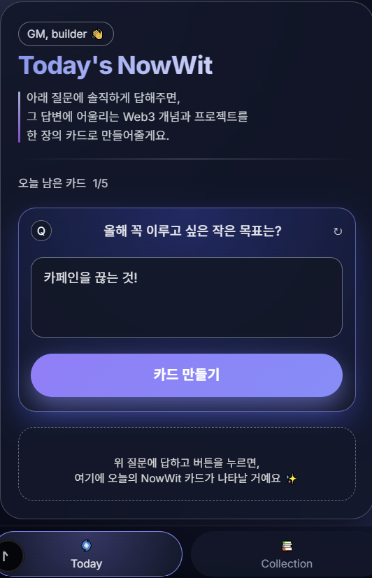
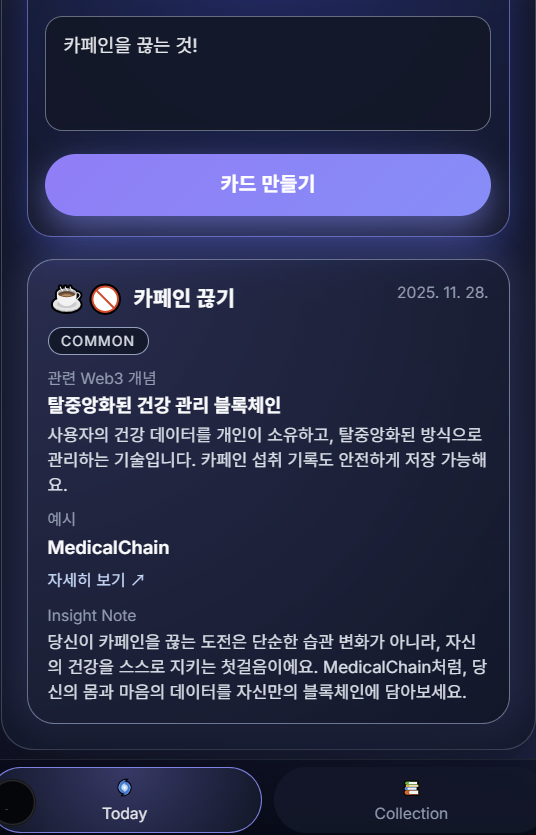
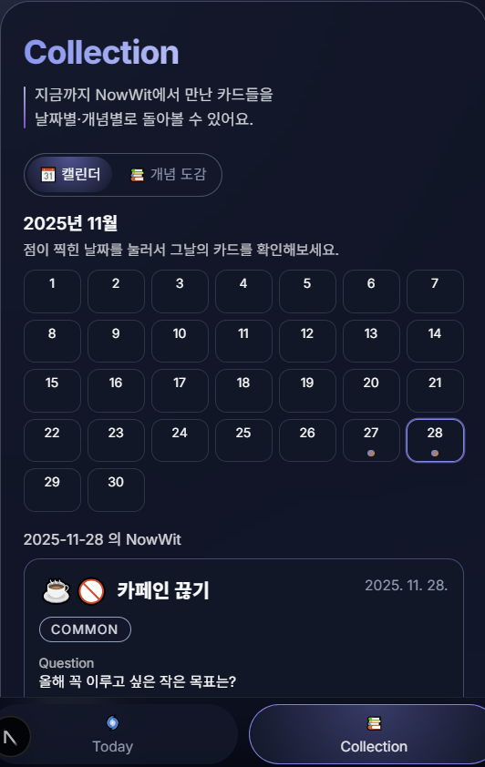
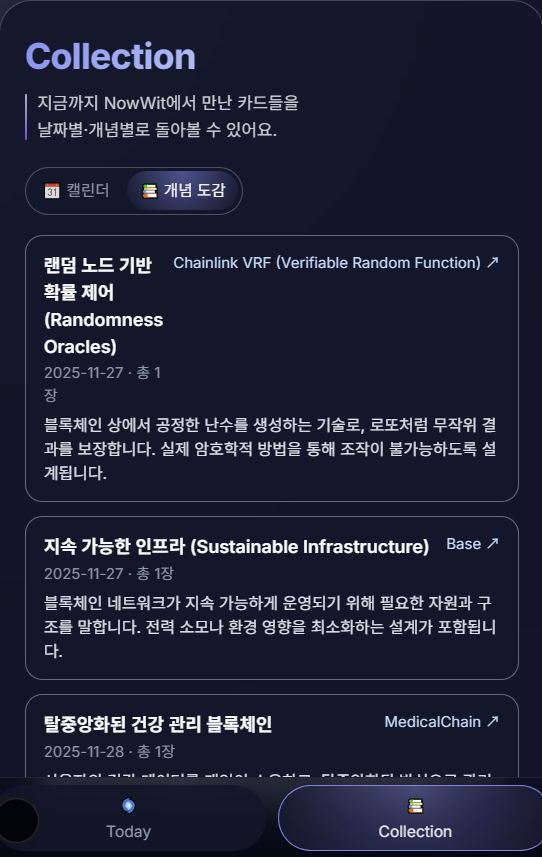

# 📘 NowWit — 감정 기반 Web3 학습 카드 Base Mini App

**NowWit**은 사용자의 감정과 일상 경험을 바탕으로  
Web3 개념을 카드 형태로 큐레이션해주는 Base Mini App입니다.

사용자가 하루의 질문에 답변하면  
FLock.io API가 감정·톤·주제를 분석하고,  
그날의 감정과 가장 잘 어울리는 Web3 개념을 자동으로 추천합니다.

---

## 🚀 Key Features

### 1. 감정 기반 Web3 학습
- 사용자의 답변을 분석하여 감정과 분위기를 파악하고  
- 그 감정과 관련된 Web3 개념과 실제 프로젝트를 카드로 생성합니다.

### 2. 하루 5장 학습 카드 루틴
- Today 탭에서 질문에 답변 → 자동으로 Web3 카드 생성  
- 부담 없이 꾸준히 학습할 수 있는 구조

### 3. Web3 학습 히스토리 제공
- Collection 탭에서 날짜별 캘린더와 Web3 개념 도감을 통해  
  지금까지 생성된 카드를 한눈에 확인할 수 있습니다.

### 4. FLock.io API 완전 연동
- 감정 분석, 개념 추천, 스토리 생성까지  
- 전체 카드 생성 과정이 FLock API 기반으로 이루어집니다.

---

## 📱 Screenshots

### Today 탭 – 질문 입력 화면
> 사용자가 오늘의 질문에 답변하는 화면입니다.

### Today 탭 – 카드 생성 화면
> 감정과 연관된 Web3 개념 카드가 생성되는 화면입니다.

### Collection 탭 – 캘린더 화면
> 날짜별 생성된 Web3 카드를 달력 형태로 볼 수 있는 화면입니다.

### Collection 탭 – 개념 도감 화면
> 지금까지 생성된 Web3 개념을 정리한 도감 화면입니다.

---

## 🧠 How It Works (Architecture)

### 카드 생성 흐름
1. 사용자가 답변 입력  
2. FLock.io API로 감정·톤·주제 분석  
3. 적합한 Web3 개념 선택  
4. 관련 Web3 프로젝트 매칭  
5. 감정–개념 연결 스토리 생성  
6. JSON 형태로 카드 데이터 반환  
7. 프론트 UI에서 카드 렌더링

---

## 🛠 Tech Stack

| Category | Technology |
|---------|------------|
| Platform | Base Mini App |
| API | FLock.io API |
| Frontend | React 기반 Mini App 구조 |
| Storage | 브라우저 로컬 상태 |
| Tools | GitHub, PNG UI 이미지 |

---

## 🌟 Value for Users

- 감정 기반 개인 맞춤형 Web3 큐레이션  
- 날짜별 캘린더와 도감을 통한 Web3 아카이브  
- 지속 가능한 Web3 학습 루틴  
- Web3 개념을 자연스럽게 폭넓게 탐색

---

## 🎬 Demo
[NowWit 발표영상 보기](https://drive.google.com/file/d/1N6bDQV0uu0chFSamojlWTKT02TlpDA-R/view?usp=sharing)
 

[NowWit 실행하기](https://nowwit.vercel.app/)

---

## 🧑‍💻 Developer
**최시원 (이화체인)**  
1인 프로젝트

